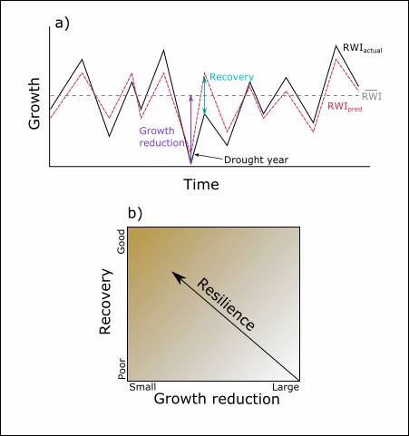

```{r setup, include=FALSE}
knitr::opts_chunk$set(echo = FALSE, warning=FALSE, message=FALSE)
library(tidyverse)
library(modelr)
library(dplR)
library(kableExtra)
library(grid)
library(gridExtra)
library(ggmap)
library(ggpmisc)
library(rgdal)
library(raster)
library(viridis)
library(brms)
library(tidybayes)
library(cowplot)
library(ggstance)
library(ggrepel)
library(outliers)

```

```{r data, include=F}
sitechar <- read.csv("Raw Data/site characteristic table.csv")

l_leg <- read.csv("Processed Data/legacy_1post.csv") %>% 
  left_join(sitechar) %>% 
  group_by(Species) %>%
  mutate(log_hegyi=log(hegyi),
         dfx_score=scores(drought_fx, type="z"),
         recov_score=scores(recovery, type="z"),
         drought_fx=ifelse(dfx_score<=-3, NA, drought_fx),
         Region=factor(Region, levels=c("San Jac", "SENF", "SEKI", "Mammoth")))
  
```

## Questions

1. How do species differ in their drought response to variable intensity and their recovery patterns?
2. If species differ, do they also vary regionally? For which species?
3. Are drought response and recovery mediated by competition and tree size and is this a species specific phenomenon or does it also vary regionally?

## Methods

I collected tree ring data from 4 regions across California and performed analyses on detrended growth during drought years where water availability (SPEI) was in the bottom 10th percentile. All tree ring series were spline detrended.


#### Key responses
$$
Growth Reduction = \frac{\overline{RWI}_{non-drought} - RWI_{drought}}{\overline{RWI}_{non-drought}}
$$
$$
Recovery = RWI_{actual} - RWI_{pred}
$$

Where $RWI_{pred}$ is the predicted growth for a tree given the post-drought year conditions based on hierarchical Bayesian models of all growth years.

```{r meas, echo=FALSE, out.width = '50%', eval=F}

fig.path = "output figures/"
```

```{r supp data, include=F}
states <- readOGR("Raw Data/cb_2016_us_state_500k/cb_2016_us_state_500k.shp")
states1 <-  states[states$NAME=="California",]
states.f <- fortify(states1, regions="STUSPS")

sites <- read.csv("Raw Data/locations for prism.csv")

raw_clim <- read.csv("Processed Data/precip_temp_spei.csv") %>% 
  filter(Year>1895) %>% 
  mutate(cutoff=quantile(spei12, .10, na.rm=T), ### Here is the drought cutoff
         droughtyear=ifelse(spei12<cutoff, "yes","no"),
         Region=factor(Region, levels=c("Mammoth", "SEKI", "SENF", "San Jac"))) 

reg_clim <- raw_clim %>% 
  group_by(Region, Year) %>% 
  summarize(spei12=mean(spei12, na.rm=T),
            total_ppt_mm=mean(total_ppt_mm),
            mean_temp_C=mean(mean_temp_C),
            droughtyear=ifelse("yes"%in%unique(droughtyear), "yes", "no"))
droughtyears <- filter(reg_clim, droughtyear=="yes")
  
avg_clim <- raw_clim %>% 
  group_by(Region, hilo) %>% 
  summarize(Latitude=mean(Latitude),
            Longitude=mean(Longitude),
            avg_ppt=mean(total_ppt_mm),
            avg_temp=mean(mean_temp_C),
            avg_spei=mean(spei12, na.rm=T))
```

```{r map, echo=F, message=F}

map <- ggplot() +
  geom_polygon(data=states.f, aes(long,lat, group=group),color="black", fill="white") +
  geom_point(data=sites, aes(X, Y, color=Y)) +
  scale_color_viridis(option='plasma') +
  theme_test() +
  ylab("Latitude") + xlab("Longitude") +
  labs(color="Latitude") +
  theme(panel.background = element_rect(fill = "lightblue")) +
  theme(legend.position = 'none') +
  theme(axis.title= element_blank()) +
  ggtitle("a)")

Tplot <- ggplot(avg_clim, aes(Region, avg_temp, fill=Region)) +
  geom_bar(stat = "summary", fun.y = "mean") +
  scale_fill_viridis(option='plasma', discrete=T, direction = -1) +
  theme_test() +
  ylab("mean temperature (C)") +
  theme(axis.title.x=element_blank()) +
  theme(legend.position = 'none') +
  ggtitle("b)")

Pplot <- ggplot(avg_clim, aes(Region, avg_ppt, fill=Region)) +
  geom_bar(stat = "summary", fun.y = "mean") +
  scale_fill_viridis(option='plasma', discrete=T, direction = -1) +
  theme_test() +
  ylab("mean precipitation (mm)") +
  theme(axis.title.x=element_blank()) +
  theme(legend.position = 'none') +
  ggtitle("c)")


drought <- ggplot(reg_clim, aes(Year, spei12, color=Region)) +
  geom_line() +
  scale_color_viridis(option='plasma', discrete=T, direction = -1) +
  facet_grid(rows = vars(Region)) +
  geom_point(data=droughtyears, aes(Year, spei12), size=2, color="red") +
  geom_vline(data=droughtyears, aes(xintercept=Year), color="red", linetype="dashed", alpha=0.4) +
  geom_text_repel(data=droughtyears, aes(Year, spei12, label=Year), color="red", nudge_y =-1, segment.size=0.3, force=0.5, size=3) +
  scale_x_continuous(limits = c(1896,2024), expand = c(0, 0)) +
  # scale_y_continuous(position = "right", limits = c(-5,2)) +
  scale_y_continuous(limits = c(-4.2,2.3)) +
  ylab("SPEI") +
  theme_test() +
  # theme(legend.position = 'none') +
  theme(strip.background = element_blank(), strip.text=element_blank(), axis.title.x=element_blank()) +
  theme(panel.spacing = unit(0, "lines"))


dummy <- ggplot(avg_clim, aes(Region, avg_ppt, fill=Region)) +
  geom_bar(stat = "summary", fun.y = "mean") +
  scale_fill_viridis(option='plasma', discrete=T, direction = -1) +
  theme_test() +
  theme(legend.title = element_blank())

legend <- cowplot::get_legend(dummy)

plot_grid(map, plot_grid(Tplot, Pplot, ncol=1), ncol=2)

drought


```

## Full model approach to Q3

This approach differs in that here we explore the results of the full expression of the model to answer the above questions i.e. the most complex justifiable model. Each species is modeled independently. This approach is a way to avoid the model selection issues we discussed regarding the complexity of question 3. 

$$
Reduction_i \sim Normal(\mu_i, \sigma_i)
$$

$$
\mu_i = \alpha_{region_i} + \alpha_{treeID} + \beta_{1region_i}SPEI_i + \beta_{2}DBH_i + \beta_{3}BA_i + \beta_{4}SPEI_i\times DBH_i + \beta_{5}SPEI_i \times BA_i 
$$

and for recovery:


$$
Recovery_i \sim Normal(\mu_i, \sigma_i)
$$

$$
\mu_i = \alpha_{region_i} + \alpha_{treeID} + \beta_{1region_i}Reduction_i + \beta_{2}DBH_i + \beta_{3}BA_i + \beta_{4}Reduction_i\times DBH_i + \beta_{5}Reduction_i \times BA_i 
$$

~~Does it make sense for DBH, comp, and interactions to vary regionally? What does this mean?~~ Regionally varying responses to drought intensity or severity could reflect local adaptation. 

### Descriptions of interaction terms

$SPEI \times DBH$ smaller or larger trees experience the same drought intensity differently. Perhaps this is due to differences in evaporative demand, root:shoot allocation patterns, height water relationship

$Reduction \times DBH$ smaller or larger trees recover from equally damaging droughts differently. Potentially due to access to resources, allocation again.

$SPEI \times log(hegyi)$ sparse or dense neighborhoods modify the effect of drought intensity. This could be via resource (water) competition. Although because we lack good characterization of the between neighborhood microsite differences density could reflect suitability more than competition.

$Reduction \times log(hegyi)$ sparse or dense neighborhoods modify the recovery of trees from equally damaging droughts. This could also be via resource competition although more than just water. Again, patterns may reflect uncharacterized microsite differences rather than competition.

### Details
All models converged Rhat ~1 and each model had few divergent samples. Param estimates and plots were prepared with tidybayes. Marginal effects plots were produced with `add_fitted_draws()` setting `re_formula = ~(spei12 + DBH + comp | Region))` excluding `(1 | tree.uniqueID)`.


```{r rfx}
rfx <- ~(spei12 | Region)
```

## Results
### Q1 Species differences
```{r q1_load}
for(i in c(2:4)){
  assign(paste("resp", i, sep=""), readRDS(paste("Brms models/final rr models/resp", i, ".rds", sep="")), envir = .GlobalEnv)
    assign(paste("recov", i, sep=""), readRDS(paste("Brms models/final rr models/recov", i, ".rds", sep="")), envir = .GlobalEnv)
}
```
#### Growth Reduction

`````{r resp_spp_table, cache=TRUE}
`SPEI only` <- add_criterion(resp2, "waic")
`Species + SPEI` <- add_criterion(resp3, "waic")
`Species * SPEI` <- add_criterion(resp4, "waic")

w <- loo_compare(`SPEI only`, `Species + SPEI`,`Species * SPEI`, criterion = "waic")

w2 <- cbind(waic_diff = w[, 1] * -2,
      se        = w[, 2] *  2)
kable(w2, "html", caption="Table SX. Growth reduction WAIC table") 
```

```{r resp_spp}
hyp <- c("exp(sigma_Intercept + sigma_SpeciesPJ) > exp(sigma_Intercept)",
         "exp(sigma_Intercept + sigma_SpeciesPL) > exp(sigma_Intercept)",
         "exp(sigma_SpeciesPL) > exp(sigma_SpeciesPJ)")
temp <-hypothesis(resp3, hyp)[[1]] 
temp$Hypothesis[1] <- "PJ - AC > 0"
temp$Hypothesis[2] <- "PL - AC > 0"
temp$Hypothesis[3] <- "PL - PJ > 0"
kable(temp, "html", caption="Table SX. Growth reduction variance contrasts") 

hyp <- c("Intercept + SpeciesPJ > Intercept", 
         "Intercept + SpeciesPL > Intercept",
         "SpeciesPL > SpeciesPJ")
temp <-hypothesis(resp3, hyp)[[1]]
temp$Hypothesis[1] <- "PJ - AC > 0"
temp$Hypothesis[2] <- "PL - AC > 0"
temp$Hypothesis[3] <- "PL - PJ > 0"
kable(temp, "html", caption="Table SX. Growth reduction intercept contrasts") 


```

#### Recovery
```{r recov_spp_table, cache=TRUE}
`No species effect`<- add_criterion(recov2, "waic")
`Varying intercept` <- add_criterion(recov3, "waic")
`Varying intercept and slope` <- add_criterion(recov4, "waic")

w <- loo_compare(`No species effect`, `Varying intercept`,`Varying intercept and slope`, criterion = "waic")

w2 <- cbind(waic_diff = w[, 1] * -2,
      se        = w[, 2] *  2)
kable(w2, "html", caption="Table SX. Recovery WAIC table") 
```

```{r recov_spp}
hyp <- c("exp(sigma_Intercept + sigma_SpeciesPJ) > exp(sigma_Intercept)",
         "exp(sigma_Intercept + sigma_SpeciesPL) > exp(sigma_Intercept)",
         "exp(sigma_SpeciesPL) > exp(sigma_SpeciesPJ)")
temp <-hypothesis(recov4, hyp)[[1]]
temp$Hypothesis[1] <- "PJ - AC > 0"
temp$Hypothesis[2] <- "PL - AC > 0"
temp$Hypothesis[3] <- "PL - PJ > 0"
kable(temp, "html", caption="Table SX. Recovery variance contrasts") 


hyp <- c("Intercept + SpeciesPJ > Intercept", 
         "Intercept + SpeciesPL > Intercept",
         "SpeciesPL > SpeciesPJ")
temp <-hypothesis(recov4, hyp)[[1]]
temp$Hypothesis[1] <- "PJ - AC > 0"
temp$Hypothesis[2] <- "PL - AC > 0"
temp$Hypothesis[3] <- "PL - PJ > 0"
kable(temp, "html", caption="Table SX. Recovery intercept contrasts") 

hyp <- c("drought_fx + SpeciesPJ:drought_fx > drought_fx", 
         "drought_fx + SpeciesPL:drought_fx > drought_fx",
         "SpeciesPL:drought_fx > SpeciesPJ:drought_fx")
temp <-hypothesis(recov4, hyp)[[1]]
temp$Hypothesis[1] <- "PJ - AC > 0"
temp$Hypothesis[2] <- "PL - AC > 0"
temp$Hypothesis[3] <- "PL - PJ > 0"
kable(temp, "html", caption="Table SX. Recovery slope contrasts") 

```

#### Main Figure
```{r q1_manip}
resp_param <- resp3 %>% 
  spread_draws(b_Intercept, b_SpeciesPJ, b_SpeciesPL, b_spei12, b_sigma_Intercept, b_sigma_SpeciesPJ, b_sigma_SpeciesPL) %>% 
  mutate(intercept_ac=b_Intercept,
         intercept_pj=b_Intercept + b_SpeciesPJ,
         intercept_pl=b_Intercept + b_SpeciesPL,
         slope_all=b_spei12,
         var_ac=exp(b_sigma_Intercept),
         var_pj=exp(b_sigma_Intercept + b_sigma_SpeciesPJ),
         var_pl=exp(b_sigma_Intercept + b_sigma_SpeciesPL) )%>% 
  dplyr::select(-contains("b_")) %>% 
    pivot_longer(-c(.chain, .iteration, .draw), 
               names_to = c("param", "Species"),
               names_sep = "_") %>% 
  group_by(param, Species) %>% 
  median_qi(.width = c(.95, .66))

recov_param <- recov4 %>% 
  spread_draws(b_Intercept, b_SpeciesPJ, b_SpeciesPL, b_drought_fx, `b_SpeciesPJ:drought_fx`, `b_SpeciesPL:drought_fx`, b_sigma_Intercept, b_sigma_SpeciesPJ, b_sigma_SpeciesPL) %>% 
  mutate(intercept_ac=b_Intercept,
         intercept_pj=b_Intercept + b_SpeciesPJ,
         intercept_pl=b_Intercept + b_SpeciesPL,
         slope_ac=b_drought_fx,
         slope_pj=b_drought_fx + `b_SpeciesPJ:drought_fx`,
         slope_pl=b_drought_fx + `b_SpeciesPL:drought_fx`,
         var_ac=exp(b_sigma_Intercept),
         var_pj=exp(b_sigma_Intercept + b_sigma_SpeciesPJ),
         var_pl=exp(b_sigma_Intercept + b_sigma_SpeciesPL) )%>% 
  dplyr::select(-contains("b_")) %>% 
    pivot_longer(-c(.chain, .iteration, .draw), 
               names_to = c("param", "Species"),
               names_sep = "_") %>% 
  group_by(param, Species) %>% 
  median_qi(.width = c(.95, .66))
```

```{r q1_fig}
p1 <- ggplot(resp_param, aes(y = param, x = value, xmin = .lower, xmax = .upper, color=Species)) +
  geom_vline(xintercept = 0, linetype="dashed") +
  geom_pointintervalh(position = position_dodgev(-0.5)) + 
  theme_test() +
  theme(legend.position = 'none') +
  xlab("Parameter estimate") + 
  scale_color_manual(values=c("#FDE725FF","#000000", "#21908CFF", "#440154FF"))+
  ggtitle("a) Growth reduction") +
  ylab("") + xlab("")

p2 <- ggplot(recov_param, aes(y = param, x = value, xmin = .lower, xmax = .upper, color=Species)) +
  geom_vline(xintercept = 0, linetype="dashed") +
  geom_pointintervalh(position = position_dodgev(-0.5)) + 
  theme_test() +
  theme(legend.position = 'none') +
  xlab("Parameter estimate") + 
  scale_color_manual(values=c("#FDE725FF","#21908CFF", "#440154FF"))+
  ggtitle("b) Recovery") +
  ylab("") 

dummy <- ggplot(l_leg, aes(x = drought_fx, y = recovery, color = Species)) +
  geom_point() + scale_color_viridis(discrete=TRUE, direction=-1) +
  theme_test()

legend <- cowplot::get_legend(dummy)

plot_grid(plot_grid(p1, p2, cols=1), legend, ncol=2, rel_widths = c(1, 0.2))

p1 <- l_leg %>%
  group_by(Species) %>%
  data_grid(spei12 = seq_range(spei12, n = 10),
            tree.uniqueID=1) %>%
  add_fitted_draws(resp3, n = 50, re_formula = NULL, allow_new_levels=TRUE) %>% 
  ggplot(aes(x = spei12, y = .value, color = Species)) +
  geom_point(data=l_leg, aes(spei12, drought_fx),alpha=0.3) +
  stat_lineribbon(aes(y = .value), .width = c(.95), alpha = 0.4) +
  stat_lineribbon(aes(y = .value), .width = .01) +
  scale_fill_brewer(palette = "Greys") +
  scale_color_viridis(discrete=TRUE, direction=-1) +
  scale_x_reverse() +
  theme_test() +
  xlab("Drought Intensity (SPEI)") +
  ylab("Growth Reduction") +
  theme(legend.position = 'none') +
  ggtitle("a)") 

p2 <- l_leg %>%
  group_by(Species) %>%
  data_grid(drought_fx = seq_range(drought_fx, n = 10),
            tree.uniqueID=1) %>%
  add_fitted_draws(recov4, n = 50, re_formula = NULL, allow_new_levels=TRUE) %>% 
  ggplot(aes(x = drought_fx, y = .value, color = Species)) +
  geom_point(data=l_leg, aes(drought_fx, recovery),alpha=0.3) +
  stat_lineribbon(aes(y = .value), .width = c(.95), alpha = 0.4) +
  stat_lineribbon(aes(y = .value), .width = .01) +
  scale_fill_brewer(palette = "Greys") +
  scale_color_viridis(discrete=TRUE, direction=-1) +
  theme_test() +
  xlab("Growth Reduction") +
  ylab("Recovery") +
  theme(legend.position = 'none') +
  ggtitle("b)") 

dummy <- ggplot(l_leg, aes(x = drought_fx, y = recovery, color = Species)) +
  geom_line() + scale_color_viridis(discrete=TRUE, direction=-1) +
  theme_test()

legend <- cowplot::get_legend(dummy)

plot_grid(p1, p2, legend, ncol=3, rel_widths = c(1, 1, 0.3))

```

### Q2 Regional Differences
```{r q2_load}
resp_list <- c("resp4_ac", "resp4_pj", "resp4_pl", "resp7_ac", "resp7_pj", "resp7_pl", "resp8_ac", "resp8_pj", "resp8_pl")
for(i in resp_list) {
  assign(i, readRDS(paste("Brms models/final rr models/", i, ".rds", sep="")), envir = .GlobalEnv)
}


recov_list <- c("recov4_ac", "recov4_pj", "recov4_pl", "recov7_ac", "recov7_pj", "recov7_pl", "recov8_ac", "recov8_pj", "recov8_pl")
for(i in recov_list) {
  assign(i, readRDS(paste("Brms models/final rr models/", i, ".rds", sep="")), envir = .GlobalEnv)
}


```
#### Growth Reduction

```{r resp_reg_table, cache=T}
spp_list <- c("ac", "pj", "pl")

for(i in spp_list) {
  mods <- str_subset(resp_list, i)
  mod1 <- get(mods[1])
  mod2 <- get(mods[2])
  mod3 <- get(mods[3])
  `No regional effects` <- add_criterion(mod1, "waic")
  `Varying intercept` <- add_criterion(mod2, "waic")
  `Varying intercept and slope` <- add_criterion(mod3, "waic")
  
  w <- loo_compare(`No regional effects`,`Varying intercept`,`Varying intercept and slope`, criterion = "waic")

  w2 <- cbind(waic_diff = w[, 1] * -2,
        se        = w[, 2] *  2)
  assign(paste("w2_", i, sep=""), w2)
}

kable(w2_ac, "html", caption="Table SX. A. concolor growth reduction WAIC table") 
kable(w2_pj, "html", caption="Table SX. P. jeffreyi growth reduction WAIC table")
kable(w2_pl, "html", caption="Table SX. P. lambertiana growth reduction WAIC table") 

```
```{r resp_icc_tables}
h <- c(paste("sd_Region__Intercept^2 / (sd_Region__Intercept^2 +",
           "sd_Region__spei12^2 + + sd_tree.uniqueID__Intercept^2 + sigma^2) = 0"),
       paste("sd_Region__spei12^2 / (sd_Region__Intercept^2 +",
           "sd_Region__spei12^2 + + sd_tree.uniqueID__Intercept^2 + sigma^2) = 0"))

temp <- hypothesis(resp8_ac, h, class=NULL)[[1]]
temp$Hypothesis[1] <- "region intercept/total"
temp$Hypothesis[2] <- "region slope/total"
kable(temp, "html", caption="Table SX. ICC for regionally varying parameters (AC, growth reduction)") 
temp <- hypothesis(resp8_pj, h, class=NULL)[[1]]
temp$Hypothesis[1] <- "region intercept/total"
temp$Hypothesis[2] <- "region slope/total"
kable(temp, "html", caption="Table SX. ICC for regionally varying parameters (PJ, growth reduction)") 
temp <- hypothesis(resp8_pl, h, class=NULL)[[1]]
temp$Hypothesis[1] <- "region intercept/total"
temp$Hypothesis[2] <- "region slope/total"
kable(temp, "html", caption="Table SX. ICC for regionally varying parameters (PL, growth reduction)") 

```

#### Recovery

```{r recov_reg_table, cache=T}
spp_list <- c("ac", "pj", "pl")

for(i in spp_list) {
  mods <- str_subset(recov_list, i)
  mod1 <- get(mods[1])
  mod2 <- get(mods[2])
  mod3 <- get(mods[3])
  `No regional effects` <- add_criterion(mod1, "waic")
  `Varying intercept` <- add_criterion(mod2, "waic")
  `Varying intercept and slope` <- add_criterion(mod3, "waic")
  
  w <- loo_compare(`No regional effects`,`Varying intercept`,`Varying intercept and slope`, criterion = "waic")

  w2 <- cbind(waic_diff = w[, 1] * -2,
        se        = w[, 2] *  2)
  assign(paste("w2_", i, sep=""), w2)
}

kable(w2_ac, "html", caption = "Table SX. A. concolor recovery WAIC table") 
kable(w2_pj, "html", caption = "Table SX. P. jeffreyi recovery WAIC table") 
kable(w2_pl, "html", caption = "Table SX. P. lambertiana recovery WAIC table")
```

```{r recov_icc_tables}

h <- c(paste("sd_Region__Intercept^2 / (sd_Region__Intercept^2 +",
           "sd_Region__drought_fx^2 + + sd_tree.uniqueID__Intercept^2 + sigma^2) = 0"), 
       paste("sd_Region__drought_fx^2 / (sd_Region__Intercept^2 +",
           "sd_Region__drought_fx^2 + + sd_tree.uniqueID__Intercept^2 + sigma^2) = 0"))

temp <- hypothesis(recov8_ac, h, class=NULL)[[1]]
temp$Hypothesis[1] <- "region intercept/total"
temp$Hypothesis[2] <- "region slope/total"
kable(temp, "html", caption="Table SX. ICC for regionally varying parameters (AC, recovery)") 
temp <- hypothesis(recov8_pj, h, class=NULL)[[1]]
temp$Hypothesis[1] <- "region intercept/total"
temp$Hypothesis[2] <- "region slope/total"
kable(temp, "html", caption="Table SX. ICC for regionally varying parameters (PJ, recovery)") 
temp <- hypothesis(recov8_pl, h, class=NULL)[[1]]
temp$Hypothesis[1] <- "region intercept/total"
temp$Hypothesis[2] <- "region slope/total"
kable(temp, "html", caption="Table SX. ICC for regionally varying parameters (PL, recovery)") 

```

#### Main Figure

```{r q2_manip}
manip <- function(mod, vars, spp){
mod %>%
  spread_draws(b_Intercept, !!sym(vars), r_Region[region,param]) %>%
  median_qi(region_int = b_Intercept + r_Region,
            region_slope = !!sym(vars) + r_Region,
            .width = c(.95, .66)) %>%
  mutate(region_mean = ifelse(param=="Intercept", region_int, region_slope),
         .upper = ifelse(param=="Intercept", region_int.upper, region_slope.upper),
         .lower = ifelse(param=="Intercept", region_int.lower, region_slope.lower),
         Species = spp,
         Region=factor(region, levels=c("San.Jac", "SENF", "SEKI", "Mammoth"))) %>%
  dplyr::select(-contains("region_int"), -contains("region_slope"))
}

contrast <- function(mod, vars) {
  mod %>% 
    spread_draws(b_Intercept, !!(sym(vars)), r_Region[region,param]) %>%
    mutate(region_int = b_Intercept + r_Region,
         region_slope = !!(sym(vars)) + r_Region,
         region_mean = ifelse(param=="Intercept", region_int, region_slope)) %>%
    compare_levels(region_mean, by=region) %>% 
    median_qi()
}

b_ac <- manip(resp8_ac, "b_spei12", "AC")
cont_ac <- contrast(resp8_ac, "b_spei12")

b_pj <- manip(resp8_pj, "b_spei12", "PJ")
cont_pj <- contrast(resp8_pj, "b_spei12")

b_pl <- manip(resp8_pl, "b_spei12", "PL")
cont_pl <- contrast(resp8_pl, "b_spei12")

resp_param <- bind_rows(b_ac, b_pj, b_pl) %>% 
  mutate(param=factor(param, levels=c("Intercept", "spei12")))

resp_cont <- bind_rows(mutate(cont_ac, Species="AC"), 
                       mutate(cont_pj, Species="PJ"),
                       mutate(cont_pl, Species="PL")) %>% 
  mutate(signif=ifelse(.upper<0&.lower<0|.upper>0&.lower>0, "yes", "no"))

b_ac <- manip(recov8_ac, "b_drought_fx", "AC")
cont_ac <- contrast(recov8_ac, "b_drought_fx")

b_pj <- manip(recov8_pj, "b_drought_fx", "PJ")
cont_pj <- contrast(recov8_pj, "b_drought_fx")

b_pl <- manip(recov8_pl, "b_drought_fx", "PL")
cont_pl <- contrast(recov8_pl, "b_drought_fx")

recov_param <- bind_rows(b_ac, b_pj, b_pl) %>% 
  mutate(param=factor(param, levels=c("Intercept", "drought_fx")))

recov_cont <- bind_rows(mutate(cont_ac, Species="AC"), 
                       mutate(cont_pj, Species="PJ"),
                       mutate(cont_pl, Species="PL"))  %>% 
  mutate(signif=ifelse(.upper<0&.lower<0|.upper>0&.lower>0, "yes", "no"))


```


```{r q2_fig}
abc <- c(AC="a)", PJ="b)", PL="c)")
def <- c(AC="d)", PJ="e)", PL="f)")

p1 <- ggplot(resp_param, aes(y = param, x = region_mean, xmin = .lower, xmax = .upper, color=Region)) +
  geom_pointintervalh(position = position_dodgev(-0.4)) + 
  geom_vline(xintercept=0, linetype="dashed") +
  facet_grid(~Species, labeller=labeller(.cols=abc)) +
  theme_test() +
  scale_color_viridis(discrete=T, option="plasma") +
  ylab("") + xlab("") + theme(legend.position = 'none') +
  theme(strip.background = element_blank(), strip.text = element_text(hjust=0, face="bold", size=rel(1.0)))

p2 <- ggplot(recov_param, aes(y = param, x = region_mean, xmin = .lower, xmax = .upper, color=Region)) +
  geom_pointintervalh(position = position_dodgev(-0.4)) + 
  geom_vline(xintercept=0, linetype="dashed") +
  facet_grid(~Species, labeller=labeller(.cols=def)) +
  theme_test() +
  scale_color_viridis(discrete=T, option="plasma") +
  ylab("") + xlab("Parameter estimate") + theme(legend.position = 'none') +
  theme(strip.background = element_blank(), strip.text = element_text(hjust=0, face="bold", size=rel(1.0)))

dummy <- ggplot(l_leg, aes(x = drought_fx, y = recovery, color = Region)) +
  geom_point() + scale_color_viridis(discrete=T, option="plasma") +
  theme_test()

legend <- cowplot::get_legend(dummy)

plot_grid(plot_grid(p1, p2, cols=1), legend, ncol=2, rel_widths = c(1, 0.2))


ggplot(resp_cont, aes(x=region_mean, y=region, color=signif)) +
  geom_pointintervalh() + facet_grid(Species~param) +
  geom_vline(xintercept = 0, linetype="dashed") +
  theme_test() +
  scale_color_grey(start=0.8, end=0)

ggplot(recov_cont, aes(x=region_mean, y=region, color=signif)) +
  geom_pointintervalh() + facet_grid(Species~param) +
  geom_vline(xintercept = 0, linetype="dashed") +
  theme_test() +
  scale_color_grey(start=0.8, end=0)
```

```{r q2_scatter}
p1 <- filter(l_leg, Species=="AC") %>%
  group_by(Region) %>% 
  data_grid(Y, spei12 = seq_range(spei12, n = 10),
            tree.uniqueID=1) %>%
  add_fitted_draws(resp8_ac, n = 50, re_formula = NULL, allow_new_levels=TRUE) %>%
  ggplot(aes(x = spei12, y = .value, color = Region)) +
  geom_point(data=filter(l_leg, Species=="AC"), aes(spei12, recovery, color = Region),alpha=0.3) +
  stat_lineribbon(aes(y = .value), .width = c(.95), alpha = 0.4) +
  stat_lineribbon(aes(y = .value), .width = .01) +
  scale_fill_brewer(palette = "Greys") +
  scale_color_viridis(discrete=TRUE, option = 'plasma') +
  # facet_wrap(vars(hilo)) +
  # ylim(-.4, .4) +
  theme_test() +
  xlab("SPEI") +
  scale_x_reverse() +
  ylab("Growth Reduction") +
  theme(legend.position='none') +
  ggtitle("a)") 

p2 <- filter(l_leg, Species=="PJ") %>%
  group_by(Region) %>% 
  data_grid(Y, spei12 = seq_range(spei12, n = 10),
            tree.uniqueID=1) %>%
  add_fitted_draws(resp8_pj, n = 50, re_formula = NULL, allow_new_levels=TRUE) %>%
  ggplot(aes(x = spei12, y = .value, color = Region)) +
  geom_point(data=filter(l_leg, Species=="PJ"), aes(spei12, recovery, color = Region),alpha=0.3) +
  stat_lineribbon(aes(y = .value), .width = c(.95), alpha = 0.4) +
  stat_lineribbon(aes(y = .value), .width = .01) +
  scale_fill_brewer(palette = "Greys") +
  scale_color_viridis(discrete=TRUE, option = 'plasma') +
  # facet_wrap(vars(hilo)) +
  # ylim(-.4, .4) +
  theme_test() +
  xlab("SPEI") +
  scale_x_reverse() +
  theme(axis.title.y=element_blank()) +
  theme(legend.position='none') +
  ggtitle("b)") 

p3 <- filter(l_leg, Species=="PL") %>%
  group_by(Region) %>% 
  data_grid(Y, spei12 = seq_range(spei12, n = 10),
            tree.uniqueID=1) %>%
  add_fitted_draws(resp8_pl, n = 50, re_formula = NULL, allow_new_levels=TRUE) %>%
  ggplot(aes(x = spei12, y = .value, color = Region)) +
  geom_point(data=filter(l_leg, Species=="PL"), aes(spei12, recovery, color = Region),alpha=0.3) +
  stat_lineribbon(aes(y = .value), .width = c(.95), alpha = 0.4) +
  stat_lineribbon(aes(y = .value), .width = .01) +
  scale_fill_brewer(palette = "Greys") +
  scale_color_manual(values=c("#0D0887FF", "#9C179EFF", "#ED7953FF"))+
  # facet_wrap(vars(hilo)) +
  # ylim(-.4, .4) +
  theme_test() +
  xlab("SPEI") +
  scale_x_reverse() +
  theme(axis.title.y=element_blank()) +
  theme(legend.position='none') +
  ggtitle("c)") 

p4 <- filter(l_leg, Species=="AC") %>%
  group_by(Region) %>% 
  data_grid(Y, drought_fx = seq_range(drought_fx, n = 10),
            tree.uniqueID=1) %>%
  add_fitted_draws(recov8_ac, n = 50, re_formula = NULL, allow_new_levels=TRUE) %>%
  ggplot(aes(x = drought_fx, y = .value, color = Region)) +
  geom_point(data=filter(l_leg, Species=="AC"), aes(drought_fx, recovery, color = Region),alpha=0.3) +
  stat_lineribbon(aes(y = .value), .width = c(.95), alpha = 0.4) +
  stat_lineribbon(aes(y = .value), .width = .01) +
  scale_fill_brewer(palette = "Greys") +
  scale_color_viridis(discrete=TRUE, option = 'plasma') +
  # facet_wrap(vars(hilo)) +
  # ylim(-.4, .4) +
  theme_test() +
  xlab("Growth Reduction") +
  ylab("Recovery") +
  theme(legend.position = 'none') +
  ggtitle("d)") 

p5 <- filter(l_leg, Species=="PJ") %>%
  group_by(Region) %>% 
  data_grid(Y, drought_fx = seq_range(drought_fx, n = 10),
            tree.uniqueID=1) %>%
  add_fitted_draws(recov8_pj, n = 50, re_formula = NULL, allow_new_levels=TRUE) %>%
  ggplot(aes(x = drought_fx, y = .value, color = Region)) +
  geom_point(data=filter(l_leg, Species=="PJ"), aes(drought_fx, recovery, color = Region),alpha=0.3) +
  stat_lineribbon(aes(y = .value), .width = c(.95), alpha = 0.4) +
  stat_lineribbon(aes(y = .value), .width = .01) +
  scale_fill_brewer(palette = "Greys") +
  scale_color_viridis(discrete=TRUE, option = 'plasma') +
  # facet_wrap(vars(hilo)) +
  # ylim(-.4, .4) +
  theme_test() +
  xlab("Growth Reduction") +
  theme(axis.title.y=element_blank()) +
  theme(legend.position = 'none') +
  ggtitle("e)") 

p6 <- filter(l_leg, Species=="PL") %>%
  group_by(Region) %>% 
  data_grid(Y, drought_fx = seq_range(drought_fx, n = 10),
            tree.uniqueID=1) %>%
  add_fitted_draws(recov8_pl, n = 50, re_formula = NULL, allow_new_levels=TRUE) %>%
  ggplot(aes(x = drought_fx, y = .value, color = Region)) +
  geom_point(data=filter(l_leg, Species=="PL"), aes(drought_fx, recovery, color = Region),alpha=0.3) +
  stat_lineribbon(aes(y = .value), .width = c(.95), alpha = 0.4) +
  stat_lineribbon(aes(y = .value), .width = .01) +
  scale_fill_brewer(palette = "Greys") +
  scale_color_manual(values=c("#0D0887FF", "#9C179EFF", "#ED7953FF"))+
  # facet_wrap(vars(hilo)) +
  # ylim(-.4, .4) +
  theme_test() +
  xlab("Growth Reduction") +
  theme(axis.title.y=element_blank()) +
  theme(legend.position = 'none') +
  ggtitle("f)")  

grid.arrange(p1, p2, p3, p4, p5, p6, ncol=3)

# plot_grid(plot_grid(p1, p2, cols=1), legend, ncol=2, rel_widths = c(1, 0.2))

```


### Q3
```{r q3_load}
resp_full_ac <- readRDS("Brms models/final rr models/resp_full_ac.rds")
resp_full_pj <- readRDS("Brms models/final rr models/resp_full_pj.rds")
resp_full_pl <- readRDS("Brms models/final rr models/resp_full_pl.rds")

recov_full_ac <- readRDS("Brms models/final rr models/recov_full_ac.rds")
recov_full_pj <- readRDS("Brms models/final rr models/recov_full_pj.rds")
recov_full_pl <- readRDS("Brms models/final rr models/recov_full_pl.rds")
```


```{r q3_manip}
varlist <- function(predictor) {
  list(sym(predictor),
    sym(paste("b_", predictor, sep="")), 
    sym(paste("b_", predictor, "_r", sep="")),
    sym(paste("b_", predictor, ":DBH", sep="")),
    sym(paste("b_", predictor, ":comp", sep="")))
}

manip <- function(mod, vars, spp){
  temp <- mod %>% 
    gather_draws(b_DBH, b_comp, !!vars[[4]], !!vars[[5]]) %>% 
    median_qi(.width = c(.95, .66)) %>% 
    mutate(region="all",
           param=ifelse(.variable=="b_DBH", "dbh",
                 ifelse(.variable=="b_comp", "comp",
                 ifelse(.variable==vars[[4]], "dbh.int", "comp.int"))))

  temp2 <- mod %>% 
    spread_draws(b_Intercept, !!vars[[2]], r_Region[region,param]) %>% 
    median_qi(intercept = b_Intercept + r_Region,
              slope = !!vars[[2]] + r_Region,
              .width = c(.95, .66)) %>% 
    mutate(.value=ifelse(param=="Intercept", intercept, slope),
           .upper=ifelse(param=="Intercept", intercept.upper, slope.upper),
           .lower=ifelse(param=="Intercept", intercept.lower, slope.lower),
           param=ifelse(param=="Intercept", "intercept", "slope")) %>% 
    dplyr::select(c(param, .value, .lower, .upper, .width, .point, .interval, region))

  bind_rows(temp, temp2) %>% 
    mutate(Species=spp)
}


p_ac <- manip(resp_full_ac, varlist("spei12"), "AC") 
p_pj <- manip(resp_full_pj, varlist("spei12"), "PJ")
p_pl <- manip(resp_full_pl, varlist("spei12"), "PL")

resp_all <- bind_rows(p_ac, p_pj, p_pl) %>% 
  mutate(region=factor(region, levels=c("all", "San.Jac", "SENF", "SEKI", "Mammoth")),
         param=factor(param, levels=c("intercept", "slope", "dbh", "comp", "dbh.int", "comp.int")),
         global=ifelse(param%in%c("intercept", "slope"), "regional", "global"),
         response="resp")

p_ac2 <- manip(recov_full_ac, varlist("drought_fx"), "AC") 
p_pj2 <- manip(recov_full_pj, varlist("drought_fx"), "PJ")
p_pl2 <- manip(recov_full_pl, varlist("drought_fx"), "PL")

recov_all <- bind_rows(p_ac2, p_pj2, p_pl2) %>% 
  mutate(region=factor(region, levels=c("all", "San.Jac", "SENF", "SEKI", "Mammoth")),
         param=factor(param, levels=c("intercept", "slope", "dbh", "comp", "dbh.int", "comp.int")),
         global=ifelse(param%in%c("intercept", "slope"), "regional", "global"),
         response="recov")

dbh_param <- bind_rows(resp_all, recov_all) %>% 
  filter(!param%in%c("intercept", "slope")) %>% 
  mutate(signif=ifelse(.upper>0&.lower>0|.upper<0&.lower<0, "yes", "no")) %>% 
  pivot_wider(id_cols = -c(".width", ".value", ".lower", ".upper", "signif"), names_from=".width", values_from = c(".value", ".lower", ".upper", "signif")) %>% 
  mutate(signif95=ifelse(signif_0.95=="yes", "yes", "no")) %>% 
  pivot_longer(cols=c(".value_0.95", ".value_0.66",".lower_0.95", ".lower_0.66", ".upper_0.95", ".upper_0.66", "signif_0.95", "signif_0.66"), names_to=c(".value",".width"), names_sep = "_") %>% 
  mutate(.width=as.numeric(.width))


```

#### Main Figure 

```{r q3_fig}      
ggplot(resp_all, aes(y = param, x = .value, xmin = .lower, xmax = .upper, color=region)) +
  geom_vline(xintercept = 0, linetype="dashed") +
  geom_pointintervalh(position = position_dodgev(-0.5)) +
  facet_wrap(global~Species, ncol=3, scales="free") +
  # facet_grid(~Species) +
  theme_test() +
  # theme(legend.position = 'none') +
  xlab("Parameter estimate") + 
  scale_color_manual(values=c("#000000", "#0D0887FF", "#9C179EFF", "#ED7953FF", "#F0F921FF"))+
  ggtitle("Growth Reduction") +
  theme(strip.background = element_blank(), strip.text = element_blank()) +
  ylab("") + xlab("")


ggplot(recov_all, aes(y = param, x = .value, xmin = .lower, xmax = .upper, color=region)) +
  geom_vline(xintercept = 0, linetype="dashed") +
  geom_pointintervalh(position = position_dodgev(-0.5)) +
  facet_wrap(global~Species, ncol=3, scales="free") +
  # facet_grid(~Species) +
  theme_test() +
  xlab("Parameter estimate") + 
  scale_color_manual(values=c("#000000", "#0D0887FF", "#9C179EFF", "#ED7953FF", "#F0F921FF"))+
  ggtitle("Recovery") +
  theme(strip.background = element_blank(), strip.text = element_blank()) +
  ylab("") + xlab("") + theme(legend.position="none")

abc <- c(AC="a)", PJ="b)", PL="c)")
def <- c(AC="d)", PJ="e)", PL="f)")

p1 <- ggplot(filter(dbh_param, response=="resp"), aes(y = param, x = .value, xmin = .lower, xmax = .upper, color=signif95)) +
  geom_vline(xintercept = 0, linetype="dashed") +
  geom_pointintervalh() +
  scale_color_grey(start=0.8, end=0) +
  facet_grid(cols=vars(Species), labeller=labeller(.cols=abc)) +
  # facet_grid(~Species) +
  theme_test() +
  # theme(legend.position = 'none') +
  xlab("Parameter estimate") + 
  theme(strip.background = element_blank(), strip.text = element_text(hjust=0, face="bold", size=rel(1.0))) +
  ylab("") + xlab("") +
  theme(legend.position = 'none')

p2 <- ggplot(filter(dbh_param, response=="recov"), aes(y = param, x = .value, xmin = .lower, xmax = .upper, color=signif95)) +
  geom_vline(xintercept = 0, linetype="dashed") +
  geom_pointintervalh() +
  scale_color_grey(start=0.8, end=0) +
  facet_grid(cols=vars(Species), labeller=labeller(.cols=def)) +
  # facet_grid(~Species) +
  theme_test() +
  # theme(legend.position = 'none') +
  xlab("Parameter estimate") + 
  theme(strip.background = element_blank(), strip.text = element_text(hjust=0, face="bold", size=rel(1.0))) +
  ylab("") + xlab("") +
  theme(legend.position = 'none')

grid.arrange(p1, p2, ncol=1)

# plotter <- function(data){
#   ggplot(data, aes(y = param, x = value, xmin = .lower, xmax = .upper, color=region)) +
#   geom_vline(xintercept = 0, linetype="dashed") +
#   geom_pointintervalh(position = position_dodgev(-0.5)) +
#   facet_wrap(global~Species, ncol=3, scales="free") +
#   # facet_grid(~Species) +
#   theme_test() +
#   # theme(legend.position = 'none') +
#   scale_color_manual(values=c("#000000", "#0D0887FF", "#9C179EFF", "#ED7953FF", "#F0F921FF"))+
#   theme(strip.background = element_blank(), strip.text = element_blank()) +
#   ylab("") + xlab("") + theme(legend.position="none")
# }
# 
# p1 <- plotter(resp_all)
# p2 <- plotter(recov_all)


  
```

#### Growth Reduction
Keep in mind that in the scatter plots the drought intensity axis is flipped, so slope will appear to be wrong sign from the parameter estimate plots.


```{r resp_full ac}
test <- filter(l_leg, Species=="AC") %>%
  group_by(Region) %>% 
  data_grid(Y, spei12 = seq_range(spei12, n = 10),
            DBH = c(10, 90, 180),
            comp = c(1, 10, 20),
            tree.uniqueID=1) %>%
  add_fitted_draws(resp_full_ac, n = 50, re_formula = NULL, allow_new_levels=TRUE) %>% 
  ungroup() %>% 
  mutate(DBH=as.factor(DBH),
         comp=as.factor(comp))

ggplot(test, aes(x = spei12, y = .value, color = Region)) +
  geom_point(data=filter(l_leg, Species=="AC"), aes(spei12, drought_fx, color = Region),alpha=0.3) +
  stat_lineribbon(aes(y = .value), .width = c(.95), alpha = 0.4) +
  stat_lineribbon(aes(y = .value), .width = .01) +
  scale_fill_brewer(palette = "Greys") +
  scale_color_viridis(discrete=TRUE, option = 'plasma') +
  scale_x_reverse() +
  # ylim(-.4, .4) +
  theme_test() +
  xlab("Drought Intensity") +
  ylab("Growth Reduction") +
  guides(fill=FALSE)+
  ggtitle("AC regional effects") 

ggplot(test, aes(x = spei12, y = .value)) +
  # geom_point(data=filter(l_leg, Species=="AC"), aes(spei12, drought_fx),alpha=0.3) +
  stat_lineribbon(aes(y = .value, color=comp), .width = c(.95), alpha = 0.4) +
  stat_lineribbon(aes(y = .value, color=comp), .width = .01) +
  scale_fill_brewer(palette = "Greys") +
  scale_color_viridis(discrete=TRUE) +
  scale_x_reverse() +
  facet_wrap(vars(Region)) +
  # ylim(-.4, .4) +
  theme_test() +
  xlab("Drought Intensity") +
  ylab("Growth Reduction") +
  guides(fill=FALSE)+
  ggtitle("AC Competition") 

ggplot(test, aes(x = spei12, y = .value)) +
  # geom_point(data=filter(l_leg, Species=="AC"), aes(spei12, drought_fx),alpha=0.3) +
  stat_lineribbon(aes(y = .value, color=DBH), .width = c(.95), alpha = 0.4) +
  stat_lineribbon(aes(y = .value, color=DBH), .width = .01) +
  scale_fill_brewer(palette = "Greys") +
  scale_color_viridis(discrete=TRUE) +
  scale_x_reverse() +
  facet_wrap(vars(Region)) +
  geom_hline(yintercept = 0, linetype="dashed") +
  # ylim(-.4, .4) +
  theme_test() +
  xlab("Drought Intensity") +
  ylab("Growth Reduction") +
  guides(fill=FALSE)+
  ggtitle("AC DBH") 

```

```{r resp_full pj}
test <- filter(l_leg, Species=="PJ") %>%
  group_by(Region) %>% 
  data_grid(Y, spei12 = seq_range(spei12, n = 10),
            DBH = c(10, 90, 180),
            comp = c(1, 10, 20),
            tree.uniqueID=1) %>%
  add_fitted_draws(resp_full_pj, n = 50, re_formula = NULL, allow_new_levels=TRUE) %>%  
  ungroup() %>% 
  mutate(DBH=as.factor(DBH),
         comp=as.factor(comp))

ggplot(test, aes(x = spei12, y = .value, color = Region)) +
  geom_point(data=filter(l_leg, Species=="PJ"), aes(spei12, drought_fx, color = Region),alpha=0.3) +
  stat_lineribbon(aes(y = .value), .width = c(.95), alpha = 0.4) +
  stat_lineribbon(aes(y = .value), .width = .01) +
  scale_fill_brewer(palette = "Greys") +
  scale_color_viridis(discrete=TRUE, option = 'plasma') +
  scale_x_reverse() +
  # ylim(-.4, .4) +
  theme_test() +
  xlab("Drought Intensity") +
  ylab("Growth Reduction") +
  guides(fill=FALSE)+
  ggtitle("PJ regional effects") 

ggplot(test, aes(x = spei12, y = .value)) +
  # geom_point(data=filter(l_leg, Species=="PJ"), aes(spei12, drought_fx),alpha=0.3) +
  stat_lineribbon(aes(y = .value, color=comp), .width = c(.95), alpha = 0.4) +
  stat_lineribbon(aes(y = .value, color=comp), .width = .01) +
  scale_fill_brewer(palette = "Greys") +
  scale_color_viridis(discrete=TRUE) +
  scale_x_reverse() +
  facet_wrap(vars(Region)) +
  # ylim(-.4, .4) +
  theme_test() +
  xlab("Drought Intensity") +
  ylab("Growth Reduction") +
  guides(fill=FALSE)+
  ggtitle("PJ Competition") 

ggplot(test, aes(x = spei12, y = .value)) +
  # geom_point(data=filter(l_leg, Species=="PJ"), aes(spei12, drought_fx),alpha=0.3) +
  stat_lineribbon(aes(y = .value, color=DBH), .width = c(.95), alpha = 0.4) +
  stat_lineribbon(aes(y = .value, color=DBH), .width = .01) +
  scale_fill_brewer(palette = "Greys") +
  scale_color_viridis(discrete=TRUE) +
  scale_x_reverse() +
  facet_wrap(vars(Region)) +
  geom_hline(yintercept = 0, linetype="dashed") +
  # ylim(-.4, .4) +
  theme_test() +
  xlab("Drought Intensity") +
  ylab("Growth Reduction") +
  guides(fill=FALSE)+
  ggtitle("PJ DBH") 
```

```{r resp_full pl}
test <- filter(l_leg, Species=="PL") %>%
  group_by(Region) %>% 
  data_grid(Y, spei12 = seq_range(spei12, n = 10),
            DBH = c(10, 90, 180),
            comp = c(1, 10, 20),
            tree.uniqueID=1) %>%
  add_fitted_draws(resp_full_pl, n = 50, re_formula = NULL, allow_new_levels=TRUE) %>% 
  ungroup() %>% 
  mutate(DBH=as.factor(DBH),
         comp=as.factor(comp))

ggplot(test, aes(x = spei12, y = .value, color = Region)) +
  geom_point(data=filter(l_leg, Species=="PL"), aes(spei12, drought_fx, color = Region),alpha=0.3) +
  stat_lineribbon(aes(y = .value), .width = c(.95), alpha = 0.4) +
  stat_lineribbon(aes(y = .value), .width = .01) +
  scale_fill_brewer(palette = "Greys") +
  scale_color_manual(values=c("#0D0887FF", "#9C179EFF", "#ED7953FF"))+
  scale_x_reverse() +
  # ylim(-.4, .4) +
  theme_test() +
  xlab("Drought Intensity") +
  ylab("Growth Reduction") +
  guides(fill=FALSE)+
  ggtitle("PL regional effects") 

ggplot(test, aes(x = spei12, y = .value)) +
  # geom_point(data=filter(l_leg, Species=="PL"), aes(spei12, drought_fx),alpha=0.3) +
  stat_lineribbon(aes(y = .value, color=comp), .width = c(.95), alpha = 0.4) +
  stat_lineribbon(aes(y = .value, color=comp), .width = .01) +
  scale_fill_brewer(palette = "Greys") +
  scale_color_viridis(discrete=TRUE) +
  scale_x_reverse() +
  facet_wrap(vars(Region)) +
  # ylim(-.4, .4) +
  theme_test() +
  xlab("Drought Intensity") +
  ylab("Growth Reduction") +
  guides(fill=FALSE)+
  ggtitle("PL Competition") 

ggplot(test, aes(x = spei12, y = .value)) +
  # geom_point(data=filter(l_leg, Species=="PL"), aes(spei12, drought_fx),alpha=0.3) +
  stat_lineribbon(aes(y = .value, color=DBH), .width = c(.95), alpha = 0.4) +
  stat_lineribbon(aes(y = .value, color=DBH), .width = .01) +
  scale_fill_brewer(palette = "Greys") +
  scale_color_viridis(discrete=TRUE) +
  scale_x_reverse() +
  facet_wrap(vars(Region)) +
  geom_hline(yintercept = 0, linetype="dashed") +
  # ylim(-.4, .4) +
  theme_test() +
  xlab("Drought Intensity") +
  ylab("Growth Reduction") +
  guides(fill=FALSE)+
  ggtitle("PL DBH") 
```

#### Recovery

```{r recov_full ac}
test <- filter(l_leg, Species=="AC") %>%
  group_by(Region) %>% 
  data_grid(Y, drought_fx = seq_range(drought_fx, n = 10),
            DBH = c(10, 90, 180),
            comp = c(1, 10, 20),
            tree.uniqueID=1) %>%
  add_fitted_draws(recov_full_ac, n = 50, re_formula = NULL, allow_new_levels=TRUE) %>% 
  ungroup() %>% 
  mutate(DBH=as.factor(DBH),
         comp=as.factor(comp))

ggplot(test, aes(x = drought_fx, y = .value, color = Region)) +
  geom_point(data=filter(l_leg, Species=="AC"), aes(drought_fx, recovery, color = Region),alpha=0.3) +
  stat_lineribbon(aes(y = .value), .width = c(.95), alpha = 0.4) +
  stat_lineribbon(aes(y = .value), .width = .01) +
  scale_fill_brewer(palette = "Greys") +
  scale_color_viridis(discrete=TRUE, option = 'plasma') +
  # facet_wrap(vars(hilo)) +
  # ylim(-.4, .4) +
  theme_test() +
  xlab("Growth Reduction") +
  ylab("Recovery") +
  guides(fill=FALSE) +
  ggtitle("AC Regional effects") 

ggplot(test, aes(x = drought_fx, y = .value)) +
  # geom_point(data=filter(l_leg, Species=="AC"), aes(drought_fx, recovery),alpha=0.3) +
  stat_lineribbon(aes(y = .value, color=comp), .width = c(.95), alpha = 0.4) +
  stat_lineribbon(aes(y = .value, color=comp), .width = .01) +
  scale_fill_brewer(palette = "Greys") +
  scale_color_viridis(discrete=TRUE) +
  facet_wrap(vars(Region)) +
  # ylim(-.4, .4) +
  theme_test() +
  xlab("Growth Reduction") +
  ylab("Recovery") +
  guides(fill=FALSE) +
  ggtitle("AC Competition") 

ggplot(test, aes(x = drought_fx, y = .value)) +
  # geom_point(data=filter(l_leg, Species=="AC"), aes(drought_fx, recovery),alpha=0.3) +
  stat_lineribbon(aes(y = .value, color=DBH), .width = c(.95), alpha = 0.4) +
  stat_lineribbon(aes(y = .value, color=DBH), .width = .01) +
  scale_fill_brewer(palette = "Greys") +
  scale_color_viridis(discrete=TRUE) +
  facet_wrap(vars(Region)) +
  geom_hline(yintercept = 0, linetype="dashed") +
  # ylim(-.4, .4) +
  theme_test() +
  xlab("Growth Reduction") +
  ylab("Recovery") +
  guides(fill=FALSE) +
  ggtitle("AC DBH") 
```

```{r recov_full pj}
test <- filter(l_leg, Species=="PJ") %>%
  group_by(Region) %>% 
  data_grid(Y, drought_fx = seq_range(drought_fx, n = 10),
            DBH = c(10, 90, 180),
            comp = c(1, 10, 20),
            tree.uniqueID=1) %>%
  add_fitted_draws(recov_full_pj, n = 50, re_formula = NULL, allow_new_levels=TRUE) %>% 
  ungroup() %>% 
  mutate(DBH=as.factor(DBH),
         comp=as.factor(comp))

ggplot(test, aes(x = drought_fx, y = .value, color = Region)) +
  geom_point(data=filter(l_leg, Species=="PJ"), aes(drought_fx, recovery, color = Region),alpha=0.3) +
  stat_lineribbon(aes(y = .value), .width = c(.95), alpha = 0.4) +
  stat_lineribbon(aes(y = .value), .width = .01) +
  scale_fill_brewer(palette = "Greys") +
  scale_color_viridis(discrete=TRUE, option = 'plasma') +
  # facet_wrap(vars(hilo)) +
  # ylim(-.4, .4) +
  theme_test() +
  xlab("Growth Reduction") +
  ylab("Recovery") +
  guides(fill=FALSE) +
  ggtitle("PJ Regional effects") 

ggplot(test, aes(x = drought_fx, y = .value)) +
  # geom_point(data=filter(l_leg, Species=="PJ"), aes(drought_fx, recovery),alpha=0.3) +
  stat_lineribbon(aes(y = .value, color=comp), .width = c(.95), alpha = 0.4) +
  stat_lineribbon(aes(y = .value, color=comp), .width = .01) +
  scale_fill_brewer(palette = "Greys") +
  scale_color_viridis(discrete=TRUE) +
  facet_wrap(vars(Region)) +
  # ylim(-.4, .4) +
  theme_test() +
  xlab("Growth Reduction") +
  ylab("Recovery") +
  guides(fill=FALSE) +
  ggtitle("PJ Competition") 

ggplot(test, aes(x = drought_fx, y = .value)) +
  # geom_point(data=filter(l_leg, Species=="PJ"), aes(drought_fx, recovery),alpha=0.3) +
  stat_lineribbon(aes(y = .value, color=DBH), .width = c(.95), alpha = 0.4) +
  stat_lineribbon(aes(y = .value, color=DBH), .width = .01) +
  scale_fill_brewer(palette = "Greys") +
  scale_color_viridis(discrete=TRUE) +
  facet_wrap(vars(Region)) +
  geom_hline(yintercept = 0, linetype="dashed") +
  # ylim(-.4, .4) +
  theme_test() +
  xlab("Growth Reduction") +
  ylab("Recovery") +
  guides(fill=FALSE) +
  ggtitle("PJ DBH") 
```

```{r recov_full pl}
test <- filter(l_leg, Species=="PL") %>%
  group_by(Region) %>% 
  data_grid(Y, drought_fx = seq_range(drought_fx, n = 10),
            DBH = c(10, 90, 180),
            comp = c(1, 10, 20),
            tree.uniqueID=1) %>%
  add_fitted_draws(recov_full_pl, n = 50, re_formula = NULL, allow_new_levels=TRUE) %>% 
  ungroup() %>% 
  mutate(DBH=as.factor(DBH),
         comp=as.factor(comp))

ggplot(test, aes(x = drought_fx, y = .value, color = Region)) +
  geom_point(data=filter(l_leg, Species=="PL"), aes(drought_fx, recovery, color = Region),alpha=0.3) +
  stat_lineribbon(aes(y = .value), .width = c(.95), alpha = 0.4) +
  stat_lineribbon(aes(y = .value), .width = .01) +
  # geom_abline(intercept=0, slope=-0.5) +
  scale_fill_brewer(palette = "Greys") +
  scale_color_manual(values=c("#0D0887FF", "#9C179EFF", "#ED7953FF"))+
  # facet_wrap(vars(hilo)) +
  # ylim(-.4, .4) +
  theme_test() +
  xlab("Growth Reduction") +
  ylab("Recovery") +
  guides(fill=FALSE) +
  ggtitle("PL Regional effects") 

ggplot(test, aes(x = drought_fx, y = .value)) +
  # geom_point(data=filter(l_leg, Species=="PL"), aes(drought_fx, recovery),alpha=0.3) +
  stat_lineribbon(aes(y = .value, color=comp), .width = c(.95), alpha = 0.4) +
  stat_lineribbon(aes(y = .value, color=comp), .width = .01) +
  scale_fill_brewer(palette = "Greys") +
  scale_color_viridis(discrete=TRUE) +
  facet_wrap(vars(Region)) +
  # ylim(-.4, .4) +
  theme_test() +
  xlab("Growth Reduction") +
  ylab("Recovery") +
  guides(fill=FALSE) +
  ggtitle("PL Competition") 

ggplot(test, aes(x = drought_fx, y = .value)) +
  # geom_point(data=filter(l_leg, Species=="PL"), aes(drought_fx, recovery),alpha=0.3) +
  stat_lineribbon(aes(y = .value, color=DBH), .width = c(.95), alpha = 0.4) +
  stat_lineribbon(aes(y = .value, color=DBH), .width = .01) +
  scale_fill_brewer(palette = "Greys") +
  scale_color_viridis(discrete=TRUE,) +
  facet_wrap(vars(Region)) +
  geom_hline(yintercept = 0, linetype="dashed") +
  # ylim(-.4, .4) +
  theme_test() +
  xlab("Growth Reduction") +
  ylab("Recovery") +
  guides(fill=FALSE) +
  ggtitle("PL DBH") 
```

```{r alltogether models, eval=F}
resp_full %>%
  spread_draws(b_Intercept, b_spei12, b_DBH, b_log_hegyi, r_Species[Species,param]) %>%
  median_qi(Species_int = b_Intercept + r_Species,
            Species_spei = b_spei12 + r_Species,
            Species_dbh = b_DBH + r_Species,
            Species_comp = b_log_hegyi + r_Species,
            .width = c(.95, .66)) %>%
  mutate(Species_mean = ifelse(param=="Intercept", Species_int, 
                               ifelse(param=="spei12", Species_spei,
                                      ifelse(param=="DBH", Species_dbh, Species_comp))),
         .upper = ifelse(param=="Intercept", Species_int.upper, 
                         ifelse(param=="spei12", Species_spei.upper,
                                ifelse(param=="DBH", Species_dbh.upper, Species_comp.upper))),
         .lower = ifelse(param=="Intercept", Species_int.lower, 
                         ifelse(param=="spei12", Species_spei.lower,
                                ifelse(param=="DBH", Species_dbh.lower, Species_comp.lower)))) %>% 
  dplyr::select(-contains("Species_int"), -contains("Species_slope")) %>% 
  ggplot(aes(y = Species, x = Species_mean, xmin = .lower, xmax = .upper, color=Species)) +
  geom_pointintervalh() + facet_wrap(vars(param), scales="free") + 
  theme_test() +
  scale_color_viridis(discrete=T, option="plasma")


recov_full <- readRDS("Brms models/final rr models/recov_full.rds")
recov_full %>%
  spread_draws(b_Intercept, b_drought_fx, b_DBH, b_log_hegyi, r_Region[region,param]) %>%
  median_qi(region_int = b_Intercept + r_Region,
            region_drought = b_drought_fx + r_Region,
            region_dbh = b_DBH + r_Region,
            region_comp = b_log_hegyi + r_Region,
            .width = c(.95, .66)) %>%
  mutate(region_mean = ifelse(param=="Intercept", region_int, 
                              ifelse(param=="drought_fx", region_drought,
                                     ifelse(param=="DBH", region_dbh, region_comp))),
         .upper = ifelse(param=="Intercept", region_int.upper, 
                         ifelse(param=="drought_fx", region_drought.upper,
                                ifelse(param=="DBH", region_dbh.upper, region_comp.upper))),
         .lower = ifelse(param=="Intercept", region_int.lower, 
                         ifelse(param=="drought_fx", region_drought.lower,
                                ifelse(param=="DBH", region_dbh.lower, region_comp.lower))),
         Region=factor(region, levels=c("San.Jac", "SENF", "SEKI", "Mammoth"))) %>% 
  dplyr::select(-contains("region_int"), -contains("region_slope")) %>% 
  ggplot(aes(y = Region, x = region_mean, xmin = .lower, xmax = .upper, color=Region)) +
  geom_pointintervalh() + facet_wrap(vars(param), scales="free") + 
  theme_test() +
  scale_color_viridis(discrete=T, option="plasma")
recov_full %>%
  spread_draws(b_Intercept, b_drought_fx, b_DBH, b_log_hegyi, r_Species[Species,param]) %>%
  median_qi(Species_int = b_Intercept + r_Species,
            Species_drought = b_drought_fx + r_Species,
            Species_dbh = b_DBH + r_Species,
            Species_comp = b_log_hegyi + r_Species,
            .width = c(.95, .66)) %>%
  mutate(Species_mean = ifelse(param=="Intercept", Species_int, 
                               ifelse(param=="drought_fx", Species_drought,
                                      ifelse(param=="DBH", Species_dbh, Species_comp))),
         .upper = ifelse(param=="Intercept", Species_int.upper, 
                         ifelse(param=="drought_fx", Species_drought.upper,
                                ifelse(param=="DBH", Species_dbh.upper, Species_comp.upper))),
         .lower = ifelse(param=="Intercept", Species_int.lower, 
                         ifelse(param=="drought_fx", Species_drought.lower,
                                ifelse(param=="DBH", Species_dbh.lower, Species_comp.lower)))) %>% 
  dplyr::select(-contains("Species_int"), -contains("Species_slope")) %>% 
  ggplot(aes(y = Species, x = Species_mean, xmin = .lower, xmax = .upper, color=Species)) +
  geom_pointintervalh() + facet_wrap(vars(param), scales="free") + 
  theme_test() +
  scale_color_viridis(discrete=T, option="plasma")
```


